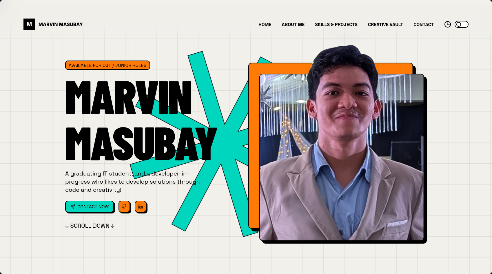

# Marvin's Portfolio

A modern, visually stunning personal portfolio website built with React and Vite, showcasing development projects, creative work, and professional skills.



**Live demo** currently hosted on 🔗 [marvin-masubay.vercel.app](https://marvin-masubay.vercel.app).

As my first major React project with no prior ReactJS experience, this portfolio has been an invaluable learning opportunity covering:
- React fundamentals and component architecture
- Tailwind CSS for modern styling
- Vite build tool and development workflow
- Responsive design principles
- Component library integration

The project demonstrates my ability to conceptualize, design, and execute a complete web application from scratch while learning new technologies independently.

## Table of Contents

- [Features](#features)
- [Tech Stack](#tech-stack)
- [Getting Started](#getting-started)
- [Building for Production](#building-for-production)
- [Project Structure](#project-structure)
- [About This Project](#about-this-project)

## Features

- **Smooth Scrolling Experience**
Elegant scroll behavior powered by Lenis for fluid navigation
- **Animated Components** 
Dynamic animations using Framer Motion for enhanced visual appeal
- **Responsive Design**
Fully responsive layout built with Tailwind CSS that works seamlessly on all devices
- **Project Showcase**
Display coding projects with screenshots and live links
- **Creative Portfolio**
Dedicated section for creative design work and visual projects
- **Contact Form**
Direct messaging capability with email integration
- **Modern UI Components**
Accessible, reusable components built with Radix UI primitives
- **Performance Optimized**
Built with Vite for fast development and production builds

## Tech Stack

- **Frontend Framework:** React 19
- **Build Tool:** Vite (with Rolldown)
- **Styling:** Tailwind CSS v4
- **UI Components:** Radix UI, custom components from [neobrutalism.dev](neobrutalism.dev) (a collection of neobrutalism-styled components based on shadcn/ui)
- **Smooth Scroll:** Lenis
- **Icons:** Lucide React

## Getting Started

### Prerequisites

- Node.js 16+ and npm/yarn installed

### Installation

1. **Clone the repository**

```bash
git clone git@github.com:benny-18/benny-s-website-portfolio.git
cd bennys-website-portfolio
```

2. **Install dependencies**

```bash
npm install
```

3. **Start the development server**

```bash
npm run dev
```
*(or with '-- --host' if you want to view the site on a different device (like your phone) like I did)
*

The site will be available at `http://localhost:5173`

### Usage

The development server includes:
- Hot Module Replacement (HMR) for instant updates as you code
- Fast Refresh for preserving component state during edits

## Project Structure

```
src/
├── components/          # Reusable UI components
│   ├── ui/             # Base UI components (buttons, cards, inputs, etc.)
│   ├── stars/          # Decorative star animations
│   └── EmailComponent  # Email functionality
├── sections/           # Page sections
│   ├── Hero.jsx        # Hero/landing section
│   ├── AboutMe.jsx     # About section
│   ├── SkillsProjects.jsx  # Coding projects showcase
│   ├── CreativeProjects.jsx # Creative work gallery
│   └── Contact.jsx     # Contact form section
├── layout/            # Layout components
│   ├── Navbar.jsx     # Navigation bar
│   └── Footer.jsx     # Footer
├── assets/            # Images and media
│   ├── coding-projects-screenshots/  # Project screenshots
│   └── creative-projects/            # Creative work images
├── lib/              # Utility functions
├── App.jsx           # Main app component
└── main.jsx          # Entry point
```

## About This Project

This portfolio showcases my creativity and personal design taste. The project was developed over **two weeks** during my free time alongside academic coursework:

- **Week 1:** Conceptualization and UI/UX planning
  - Created detailed prototype on Figma - 🔗 [Website Portfolio Prototype](https://www.figma.com/design/U7uub3RaCq3Ykd8S2N9fxb/Website-Portfolio-Prototype?node-id=0-1&t=x19HZ3W0ESnTCYKt-1)
  - Planned design direction like colors and fonts, and layout structure 

- **Week 2:** Full development from scratch
  - Implemented design into fully functional React application
  - Entirely my own work to showcase personal learning and design interests (strived not to rely on any AI tools but still did for at least 5-10% coz there were still some things I wasn't familiar about either React or how some things would've been coded better especially on making sure that the portfolio would be responsive and would still look fine in both phones and widescreen).
  
Let me know what you think by sending me an email at 📧 [2201410@lnu.edu.ph](mailto:2201410@lnu.edu.ph) !! :)